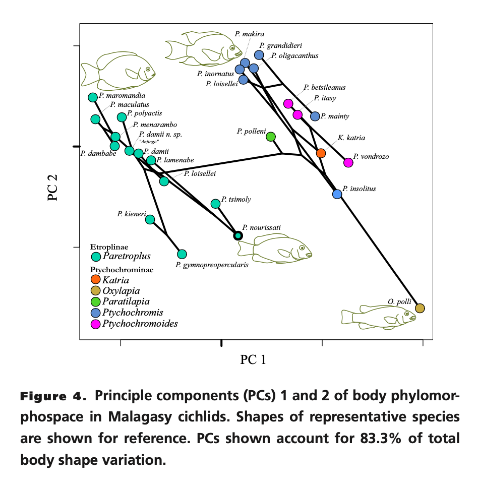
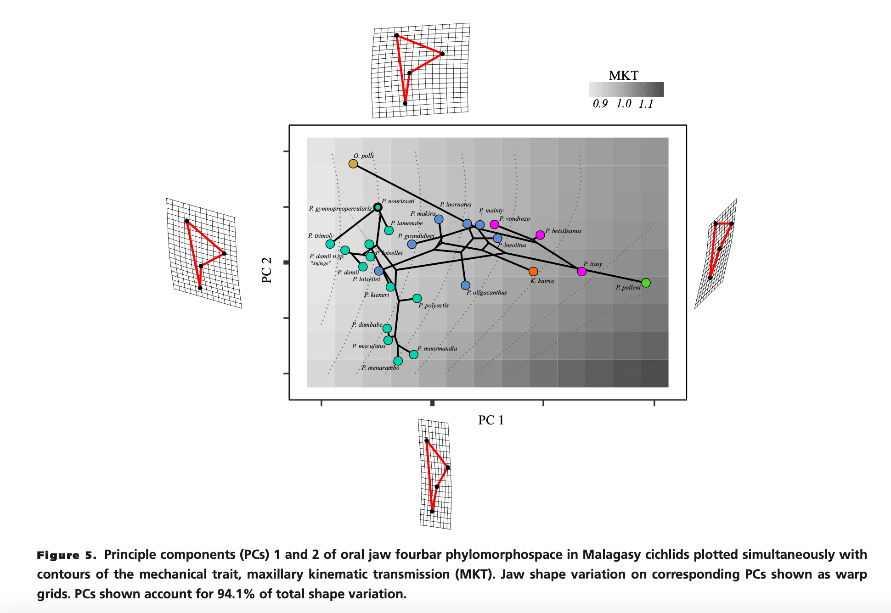
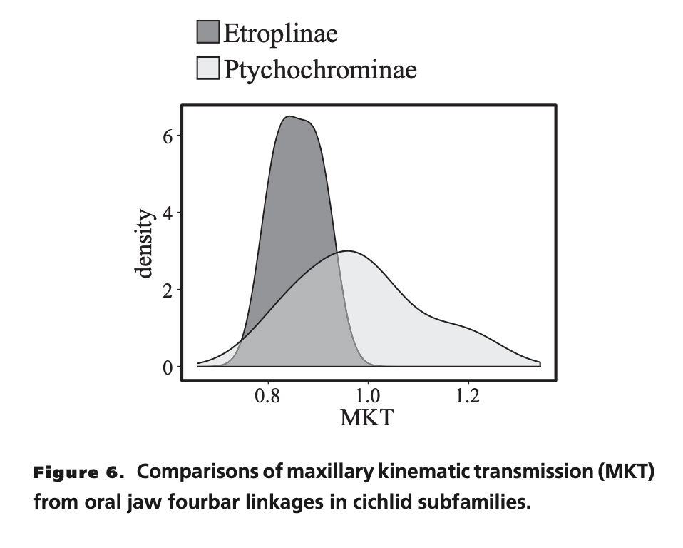
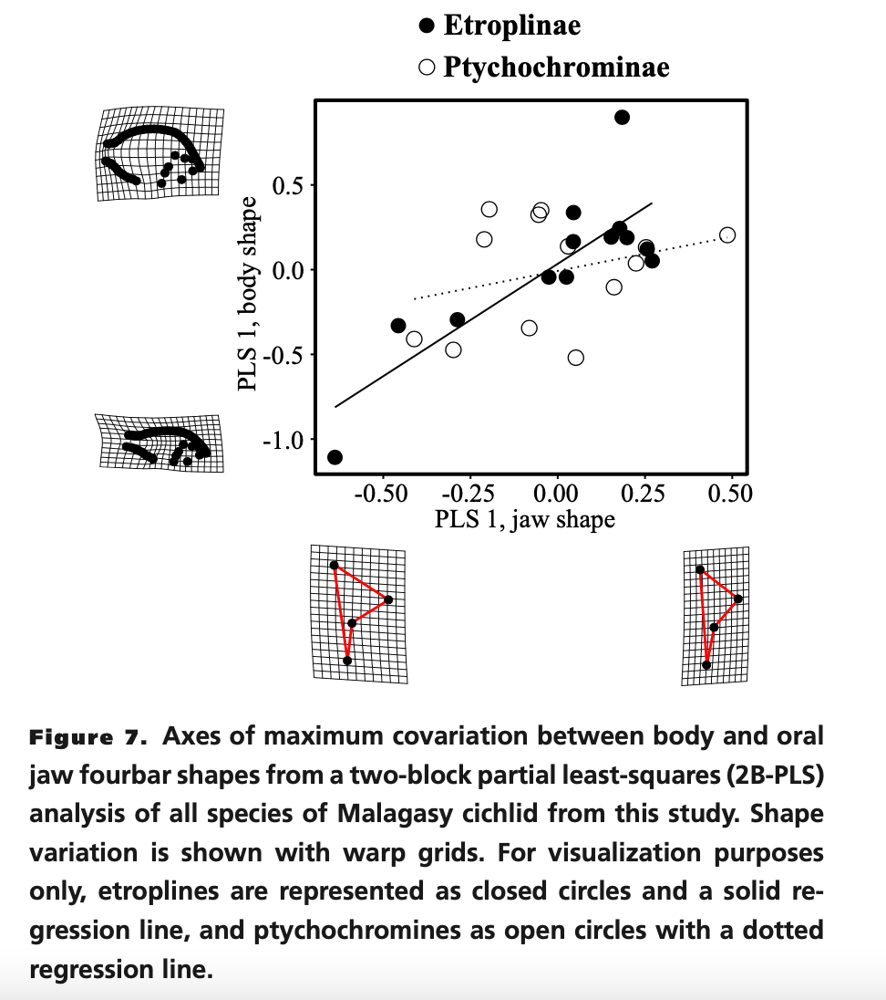

```{r setup, include=FALSE}
knitr::opts_chunk$set(
  eval = TRUE, # run code in code chunks
  echo = TRUE, # render output of code chunks
	warning = TRUE,
	message = TRUE,
	comment = "##",
	prompt = FALSE,
	tidy = TRUE,
	tidy.opts = list(blank = FALSE, width.cutoff = 75),
	fig.path = "images/",
	fig.align = "center"
) #tells {knitr} where to output figures/where to find images of figures
```
## Introduction

Martinez 2017 sought out to...

[Include a brief summary of the paper you are reanalyzing data from (e.g., the overall objective of the paper, the types of data collected and how sampling was done, what the main results were) and lay out what you intend to replicate.]

```{r Preliminaries, message=FALSE}
require(tidyverse)
require(ggplot2)
require(ggfortify)
require(MASS)
require(caret)
require(AppliedPredictiveModeling)
require(lars)
require(pls)
require(stats)
require(FactoMineR)
require(factoextra)
require(geomorph)
```

## Visualization of Data

[Include a view of the first few lines of the dataset plus any exploratory data analysis - e.g., overview of descriptive statistics included in the paper, plots, etc.]
```{r d1 Data, echo=TRUE, message=FALSE, warning=FALSE, collapse=FALSE}
#Figure data
bs_f <- "https://raw.githubusercontent.com/jyhrehjohnson/data-analysis-replication/main/data/body%20shape%20coordinates.csv"
d1 <- read.csv(bs_f, header = TRUE, stringsAsFactors = FALSE)
```
```{r d1 Output, collapse=FALSE}
head(d1,3)
```

```{r d2 Data, echo=TRUE, message=FALSE, warning=FALSE, collapse=FALSE}
#Figure data
fbs_f <- "https://raw.githubusercontent.com/jyhrehjohnson/data-analysis-replication/main/data/fourbar%20shape%20coordinates.csv"
d2 <- read.csv(fbs_f, header = TRUE, stringsAsFactors = FALSE)
```
```{r d2 Output, collapse=FALSE}
head(d2,3)
```

```{r d3 Data, echo=TRUE, message=FALSE, warning=FALSE, collapse=FALSE}
#Figure data
mkt_f <- "https://raw.githubusercontent.com/jyhrehjohnson/data-analysis-replication/main/data/hypothetical%204bars%2C%20MKT.csv"
d3 <- read.csv(mkt_f, header = TRUE, stringsAsFactors = FALSE)
```
```{r d3 Output, collapse=FALSE}
head(d3,3)
```

```{r d4 Data, echo=TRUE, message=FALSE, warning=FALSE, collapse=FALSE}
#Figure data
species_f <-"https://raw.githubusercontent.com/jyhrehjohnson/data-analysis-replication/main/data/species%20info.csv"
d4 <- read.csv(species_f, header = TRUE, stringsAsFactors = FALSE)
```
```{r d4 Output, collapse=FALSE}
head(d4,3)
```

## Statistical Replications/Reanalysis

[Be sure to **thoroughly** explain what replications you are doing and comment your code so that it is easy for a reader to understand. Include in this section relevant tables/figures/values from the original paper for comparison to what you accomplished with your replication. Note that I want you to do the bulk of any *exposition* using text and markdown syntax outside of code blocks. That is, your document should not just be one big code block with ***R*** style comments but rather a nicely formatted report with code separated from exposition, interpretation, and discussion.]

## 2. Figure 4 Reduplication | PCA of Body Phylomorphospace

Data Preparation
```{r}
#Prep the data 
bs_data <- d1
d1_mod <- str_split_fixed(d1$species, "_", 2) #split the original species column into two (Genus name & Species name)
d1_mod <- as.data.frame(d1_mod, row.names = NULL, optional = FALSE) #make the modified data set a data frame
bs_data_mod <- d1 %>% mutate(genus = d1_mod$V1) #add the column genus 
bs_data_mod <- bs_data_mod %>% relocate(genus, .after = species) #move the new genus column after the species column
```

PCA Analysis
```{r}
#Calculate the Principal Components
bs_data_scaled <- scale(bs_data[, -1], 
                     center = TRUE, 
                     scale = TRUE)
#head(bs_data_scaled,3)

e1 <- eigen(cov(bs_data[, -1]))
#head(e1,3)

e1.scaled <- eigen(cov(bs_data_scaled))
#head(e1.scaled,3)

e1.scaled$values #Variances
e1.scaled$values/6 #proportion of variances
cumsum(e1.scaled$values/6) #Cumulative proportion

bs_data_pc <- as.matrix(bs_data_scaled) %*% e1.scaled$vectors 
#head(bs_data_pc,3)

bs_pca <- prcomp(bs_data[, -1],
             center = TRUE,
             scale. = TRUE)
#head(bs_pca$x,3)

summary(bs_pca)

bs_pc_plot <- autoplot(bs_pca, data  = bs_data_mod, colour = 'genus') #plot the pca coloring the data by genus 
bs_pc_plot
```
```{r echo=FALSE, out.width="70%"}

```

## 3. Figure 5 Reduplication | PCA of Oral Jaw Phylomorphospace
Data Preparation
```{r}
#Prep the data 
oj_data <- d2

d2_mod <- str_split_fixed(d2$species, "_", 2) #split the original species column into two (Genus name & Species name)
d2_mod <- as.data.frame(d2_mod, row.names = NULL, optional = FALSE) #make the modified data set a data frame
oj_data_mod <- d2 %>% mutate(genus = d2_mod$V1) #add the column genus 
oj_data_mod <- oj_data_mod %>% relocate(genus, .after = species) #move the new genus column after the species column
```

PCA Analysis
```{r}
#Calculate the Principal Components
oj_data_scaled <- scale(oj_data[, -1], 
                     center = TRUE, 
                     scale = TRUE)
#head(oj_data_scaled,3)

e2 <- eigen(cov(oj_data[, -1]))
#head(e2,3)

e2.scaled <- eigen(cov(oj_data_scaled))
#head(e2.scaled,3)

e2.scaled$values #Variances
e2.scaled$values/6 #proportion of variances
cumsum(e2.scaled$values/6) #Cumulative proportion

oj_data_pc <- as.matrix(oj_data_scaled) %*% e2.scaled$vectors 
#head(oj_data_pc,3)

oj_pca <- prcomp(oj_data[, -1],
             center = TRUE,
             scale. = TRUE)
#head(oj_pca$x,3)

summary(oj_pca)

oj_pc_plot <- autoplot(oj_pca, data  = oj_data_mod, colour = 'genus') #plot the pca coloring the data by species 
oj_pc_plot
```
```{r echo=FALSE, out.width="70%"}

```

## 4. Figure 6 Reduplication | Comparison MKT Density Plot
```{r}
#Actually works! I really did that OMG. Looks somewhat like the original figure, I can't figure out how to fix the dip in the graph however.
mkt_plot <- ggplot(d4, aes(x = MKT)) +
       geom_density(aes(group = subfamily, fill = subfamily), alpha = 0.5) + 
       xlim(c(min(d4$MKT), c(max(d4$MKT)))) +
       scale_fill_discrete(name = NULL , labels = c("Etroplinae", "Ptychochrominae"))

mkt_plot
```
```{r echo=FALSE, out.width="70%"}

```

## 5. Figure 7 Reduplication | Axis of Covariation
```{r}
#head(d4)
#two-block partial least square

set.seed(1)
shape1 <-plsr(jaw_centroid_size ~ body_centroid_size, data=d4, scale=TRUE, validation = "CV")

summary(shape1)

validationplot(shape1)
validationplot(shape1, val.type="MSEP")
validationplot(shape1, val.type="R2")

shape_train <- d4[1:13, c("jaw_centroid_size", "body_centroid_size")]
shape_test <- d4[26:nrow(d4), c("jaw_centroid_size")]
test <- d4[26:nrow(d4), c("body_centroid_size")]

shape1 <- plsr(jaw_centroid_size ~ body_centroid_size, data=shape_train, scale=TRUE, validation="CV")

plot(RMSEP(shape1), main=NULL)
plot(shape1, ncomp = 1, asp = 1, line = TRUE, xlab="PLS 1, jaw shape", ylab="PLS 1, body shape", main=d4$subfamily[c(1,14)], color=d4$subfamily)


#2B-PLS between head shape and food use data
PLS <-two.b.pls(d4$jaw_centroid_size,d4$body_centroid_size,iter=26)
summary(PLS)
plot(PLS)
#ggplot(d4, aes(x=jaw_centroid_size, y=body_centroid_size, color=subfamily))
```
```{r echo=FALSE, out.width="70%"}

```

## Summary/Discussion

[Narrative section that overviews how successful were you at replicating the analyses and visualizations in the study. What problems did you encounter? Why might you have encountered those problems? What details were lacking from the original study's methods that might have hampered your ability to replicate the authors' results?]

## References
Martinez,Christopher M., Sparks,John S. 2017. Malagasy cichlids differentially limit impacts of body shape evolution on oral jaw functional morphology. Evolution. Volume 71, Issue 9 p. 2219-2229. https://onlinelibrary.wiley.com/doi/10.1111/evo.13298

Dryad Data Download: https://datadryad.org/stash/dataset/doi:10.5061/dryad.k3b10
