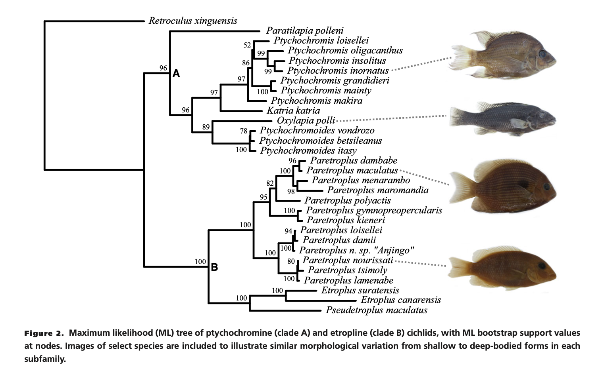

```{r setup, include=FALSE}
knitr::opts_chunk$set(
  eval = TRUE, # run code in code chunks
  echo = TRUE, # render output of code chunks
	warning = TRUE,
	message = TRUE,
	comment = "##",
	prompt = FALSE,
	tidy = TRUE,
	tidy.opts = list(blank = FALSE, width.cutoff = 75),
	fig.path = "images/",
	fig.align = "center"
) #tells {knitr} where to output figures/where to find images of figures
```
## Introduction

Martinez 2017 sought out to discover the patterns of integration and modularity between two variations of Malagasy cichlid fish: Cichildae and Teleostei. The authors utilized geometric morphometrics to evaluate the relationship between body shape and oral jaw functional morphology. This study also focused on the many-to-one mapping of form to function traits within vertebrate body plans. The data collected for this study included, specimens from the American Museum of Natural History and the University of Michigan Museum of Zoology and body landmarks taken from each specimen collected. The primary results from this paper suggested that many-to-one mapping allowed for more variation between Cichildae and Teleostei traits which reduces the functionality of those traits. For the purpose of this assignment, I will be attempting to replicate the principle component analysis represented in Figures 4 and 5 and the density comparison of the maxillary kinematic transmission from oral jaw fourbar between the two subfamilies (Figure 6). 

```{r Preliminaries, message=FALSE}
#allow user to download all packages used for project
require(tidyverse)
require(ggplot2)
require(ggfortify)
require(MASS)
require(caret)
require(lars)
require(stats)
require(FactoMineR)
require(factoextra)
require(geomorph)
require(ape)
require(phangorn)
require(phytools)
```

## Visualization of Data

This section of the project, allows you to see the first three lines of each data set. I acquired the data used in Martinez 2017 from Dryad, an open data repository where authors can post their collected data. The coordinates of the landmarks taken from each specimen where visualized originally in a .txt format. For ease of coding, I converted the .txt files to .csv. The data sets also include body and oral jaw centroid size and the maxillary kinematic transmission. 

```{r d1 Data, echo=TRUE, message=FALSE, warning=FALSE, collapse=FALSE}
#Figure data
max_tree_f <-"https://raw.githubusercontent.com/jyhrehjohnson/data_analysis_replication/main/data/malagasy%2C%20south%20asian%20cichlid.tre.txt"
d1 <- read.nexus(max_tree_f, tree.names = NULL, force.multi = FALSE)
head(d1,3)
```

```{r d2 Data, echo=TRUE, message=FALSE, warning=FALSE, collapse=FALSE}
#Figure data
bs_f <- "https://raw.githubusercontent.com/jyhrehjohnson/data_analysis_replication/main/data/body%20shape%20coordinates.csv"
d2 <- read.csv(bs_f, header = TRUE, stringsAsFactors = FALSE)
```
```{r d1 Output, collapse=FALSE}
head(d2,3, col=6) #print the first 3 lines and 6 columns of data for visualization
```

```{r d3 Data, echo=TRUE, message=FALSE, warning=FALSE, collapse=FALSE}
#Figure data
fbs_f <- "https://raw.githubusercontent.com/jyhrehjohnson/data_analysis_replication/main/data/fourbar%20shape%20coordinates.csv"
d3 <- read.csv(fbs_f, header = TRUE, stringsAsFactors = FALSE)
```
```{r d2 Output, collapse=FALSE}
head(d3,3, col=6) #print the first 3 lines and 6 columns of data for visualization
```

```{r d4 Data, echo=TRUE, message=FALSE, warning=FALSE, collapse=FALSE}
#Figure data
species_f <-"https://raw.githubusercontent.com/jyhrehjohnson/data_analysis_replication/main/data/species%20info.csv"
d4 <- read.csv(species_f, header = TRUE, stringsAsFactors = FALSE)
```
```{r d3 Output, collapse=FALSE}
head(d4,3, col=6) #print the first 3 lines and 6 columns of data for visualization
```

## Statistical Replications/Reanalysis


## Figure 2 Replication | Maximum Likelihood Tree 
```{r}
#Plot the maximum likelihood
plotTree(d1,fsize=0.8,lwd=1,offset=1) #Plot the ML, set font size, create space so nodes aren't on top of each other 
nodelabels(d1$node.label, adj = c(1, 0), frame = "none") #label the nodes
```

**Figure I Attempted to Replicate:**
```{r echo=FALSE, out.width="70%"}

```

## Figure 4 Replication | PCA of Body Phylomorphospace

**Data Preparation**

In this section of code, I prepped the dataset in order to make the actual principle component analysis easier. Here I created a new variable bs_data which is the d1 data set. Next, I modified the original d1 dataset to separate the species column into genus name and species name. (This allowed me to later color the data points by genus.) I added the new column 'genus' to the bs_data dataset, then I moved the genus name after the species name in the data set. 
```{r}
#Prep the data 
bs_data <- d2
d2_mod <- str_split_fixed(d2$species, "_", 2) #Split the original species column into two (Genus name & Species name)
d2_mod <- as.data.frame(d2_mod, row.names = NULL, optional = FALSE) #Make the modified data set a data frame
bs_data_mod <- d2 %>% mutate(genus = d2_mod$V1) #Add the column genus 
bs_data_mod <- bs_data_mod %>% relocate(genus, .after = species) #Move the new genus column after the species column
```

**PCA Analysis**

After prepping the data, I calculated the principle components. I started by scaling the data removing the first column of data, leaving only numeric values. Then I got the eigen values from the dataset. Next I scaled the eigen values and calculated their variance. Lastly, I used the prcomp function to calculate the pca.
```{r}
#Calculate the Principal Components
bs_data_scaled <- scale(bs_data[, -1], #Use the bs_data removing the first column, leaving only numeric values in the dataset. 
                     center = TRUE, 
                     scale = TRUE)
head(bs_data_scaled,3, col=6) #Print the first 3 lines and 6 columns of data for visualization

e1 <- eigen(cov(bs_data[, -1]))
head(e1,3, col=6) #Print the first 3 lines and 6 columns of data for visualization

e1.scaled <- eigen(cov(bs_data_scaled))
head(e1.scaled,3, col=6) #Print the first 3 lines and 6 columns of data for visualization

e1.scaled$values #Calculate the variances
e1.scaled$values/6 #Proportion of variances
cumsum(e1.scaled$values/6) #Cumulative proportion

bs_data_pc <- as.matrix(bs_data_scaled) %*% e1.scaled$vectors 
head(bs_data_pc,3, col=6) #Print the first 3 lines and 6 columns of data for visualization

bs_pca <- prcomp(bs_data[, -1], #Use the bs_data removing the first column, leaving only numeric values in the dataset. 
             center = TRUE,
             scale. = TRUE)
head(bs_pca$x,3, col=6) #Print the first 3 lines of data for visualization

summary(bs_pca) #Summarize the data within the new pca

bs_pc_plot <- autoplot(bs_pca, data  = bs_data_mod, colour = 'genus') #Plot the pca coloring the data by genus 
bs_pc_plot
```

**Figure I Attempted to Replicate:**
```{r echo=FALSE, out.width="70%"}
knitr::include_graphics("images/pc_of_bodyphylomorphospace.png")
```

## Figure 5 Replication | PCA of Oral Jaw Phylomorphospace
**Data Preparation**

I used the same method see above to calculate the PCA of Oral Jaw Phylomorphospace. I prepped the data set in order to make the actual principle component analysis easier. Here I created a new variable oj_data which is the d2 dataset. Next, I modified the original d2 data set to separate the species column into genus name and species name. (This allowed me to later color the data points by genus.) I add the new column 'genus' to the oj_data data set, then I moved the genus name after the species name in the data set. 
```{r}
#Prep the data 
oj_data <- d3

d3_mod <- str_split_fixed(d3$species, "_", 2) #split the original species column into two (Genus name & Species name)
d3_mod <- as.data.frame(d3_mod, row.names = NULL, optional = FALSE) #Make the modified data set a data frame
oj_data_mod <- d3 %>% mutate(genus = d3_mod$V1) #Add the column genus 
oj_data_mod <- oj_data_mod %>% relocate(genus, .after = species) #Move the new genus column after the species column
```

**PCA Analysis**

Again, here I used the same method seen in the Figure 4 analysis description. After prepping the data, I calculated the principle components. I started by scaling the data removing the first column of data, leaving only numeric values. Then I got the eigen values from the data set. Next I scaled the eigen values and calculated their variance. Lastly, I used the prcomp function to calculate the pca.

```{r}
#Calculate the Principal Components
oj_data_scaled <- scale(oj_data[, -1], #Use the oj_data removing the first column, leaving only numeric values in the data set. 
                     center = TRUE, 
                     scale = TRUE)
head(oj_data_scaled,3, col=6) #Print the first 3 lines and 6 columns of data for visualization

e2 <- eigen(cov(oj_data[, -1])) #Use the oj_data removing the first column, leaving only numeric values in the data set. 
head(e2,3, col = 6) #Print the first 3 lines and 6 columns of data for visualization

e2.scaled <- eigen(cov(oj_data_scaled))
head(e2.scaled,3, col=6) #Print the first 3 lines and 6 columns of data for visualization

e2.scaled$values #Calculate the variances
e2.scaled$values/6 #Proportion of variances
cumsum(e2.scaled$values/6) #Cumulative proportion

oj_data_pc <- as.matrix(oj_data_scaled) %*% e2.scaled$vectors 
head(oj_data_pc,3, col=6) #Print the first 3 lines and 6 columns of data for visualization

oj_pca <- prcomp(oj_data[, -1], #Use the oj_data removing the first column, leaving only numeric values in the data set. 
             center = TRUE,
             scale. = TRUE)
head(oj_pca$x,3, col=6) #Print the first 3 lines and 6 columns of data for visualization

summary(oj_pca) #Summarize the data within the new pca

oj_pc_plot <- autoplot(oj_pca, data  = oj_data_mod, colour = 'genus') #Plot the pca coloring the data by species 
oj_pc_plot
```

**Figure I Attempted to Replicate:**
```{r echo=FALSE, out.width="70%"}
knitr::include_graphics("images/pc_of-oraljaw.png")
```

## Figure 6 Replication | Comparison MKT Density Plot
```{r}
#Actually works! I really did that OMG. 

#Use ggplot to plot the comparison of MKT between subfamilies
mkt_plot <- ggplot(d4, aes(x = MKT)) +
       geom_density(aes(group = subfamily, fill = subfamily), alpha = 0.5) + 
       xlim(c(min(d4$MKT), c(max(d4$MKT)))) +
       scale_fill_discrete(name = NULL , labels = c("Etroplinae", "Ptychochrominae"))

mkt_plot
```

**Figure I Attempted to Replicate:**
```{r echo=FALSE, out.width="70%"}
knitr::include_graphics("images/comparison_of_MKT.png")
```

## Summary/Discussion
**Disclaimer**
The Dryad information did provide "Usage Notes" for the data, however I decided to look at those after I completed the assignment to see if I used the correct data sets for each analysis I was attempting to replicate. To my knowledge I used the correct data sets for Figures 2, 4 & 6, but maybe not Figure 5.

**Figure 2 Replication**
I think I was successful in replicating this analysis. A main problem I encountered was trying to figure out how to read the maximum likelihood file (a Nexus file) into R. I was a bit confused as the nexus file output as a text file so I was searching through R "Help" for a specific library to load. But I found that I only needed to use read.nexus. 

**Figure 4 Replication**
For this figure, I believe I was fairly successful replicating the analysis. The majority of the points are in the corresponding position as the original graph although some are slightly off. I encountered a few problems when making this PCA, first it was figuring out how the authors connected the points within and between each genus. Instead of a normal PCA, the graphs were Phylomorphospace or a phylogenetic principle component analysis. Through the "Help" icon in RStudio, I was able to find the function phylo.pca which would help with creating a phylogenetic tree and plotting a pca. I struggled with trying to figure out how to use phyl.pca so after a few failed attempts I decided to try and run a regular PCA with the data. 

**Figure 5 Replication**
Like Figure 4, I was fairly successful with replicating the analysis. Again, the main problem I encountered during this section was that I had a hard time using the phylo.pca function in order to produce a phylogeny and pca simultaneously. I also may have used the wrong data set for this analysis since a few of the data points are a bit off. For this analysis I decided to just plot the PCA itself. Working with Figure 4 & 5 I learned how to separate characters within a single column into two individual columns, how to add/move columns in data frames, and one way to calculate principle component analyses. 

**Figure 6 Replication**
I believe I was quite successful with replicating this analysis. Honestly I am very happy with how this figure came out! It looks somewhat like the original figure although there are slight dips in the corresponding graphs. This was the main problem I encountered when programming this section of code. I couldn't figure out how to fix the dip in the graph. I'm not sure if I input the data incorrectly or if I am using the wrong data set? 


## References
Martinez,Christopher M., Sparks,John S. 2017. Malagasy cichlids differentially limit impacts of body shape evolution on oral jaw functional morphology. Evolution. Volume 71, Issue 9 p. 2219-2229. https://onlinelibrary.wiley.com/doi/10.1111/evo.13298

Dryad Data Download: https://datadryad.org/stash/dataset/doi:10.5061/dryad.k3b10
